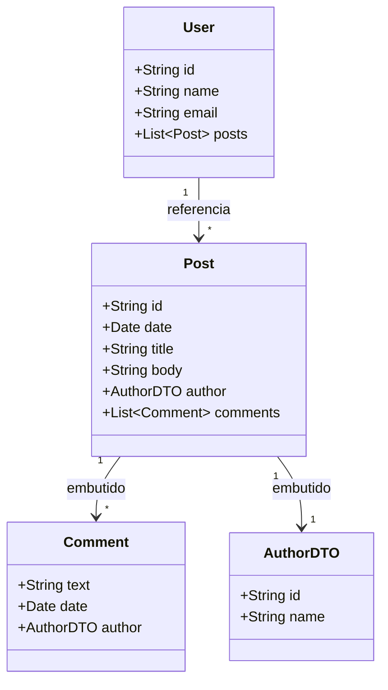

# Workshop Spring Boot com MongoDB

[](https://openjdk.org/projects/jdk/17/)
[](https://spring.io/projects/spring-boot)
[](https://www.mongodb.com/cloud/atlas)
[](https://github.com/Jacques-Trevia/workshop-spring-boot-mongodb/blob/main/LICENSE)

## 📖 Sobre o Projeto

Este projeto é um **workshop prático** desenvolvido durante o curso **Java Spring Professional** da DevSuperior. O objetivo é construir uma API REST completa utilizando **Spring Boot** com **MongoDB** (banco de dados NoSQL), explorando conceitos como:

- Modelagem de dados orientada a documentos
- Relacionamentos (embutidos e referenciados) com MongoDB
- Operações de CRUD
- Consultas com Spring Data MongoDB
- Tratamento de exceções

A aplicação simula um sistema similar a uma rede social ou blog, onde usuários podem postar mensagens e receber comentários.

## ✨ Funcionalidades

- **CRUD de Usuários**: Cadastro, listagem, busca por ID, atualização e remoção.
- **CRUD de Posts**: Criação de posts com título, corpo e data.
- **Sistema de Comentários**: Adicionar comentários a posts existentes.
- **Consultas Personalizadas**:
  - Buscar posts por título (ignorando maiúsculas/minúsculas).
  - Buscar posts com múltiplos critérios (ex: título, data, etc.).
  - Listar todos os usuários.
- **Tratamento de Exceções**: Respostas de erro padronizadas (RFC 7807) com a classe `StandardError`.

## 🚀 Tecnologias Utilizadas

- **Java 17**: Linguagem de programação.
- **Spring Boot**: Framework principal.
- **Spring Data MongoDB**: Integração com MongoDB.
- **MongoDB Atlas**: Banco de dados NoSQL em nuvem (ou local).
- **Maven**: Gerenciador de dependências.
- **Postman**: Teste de requisições (coleção incluída).

## 📁 Estrutura do Projeto
```
src/
├── main/
│ ├── java/com/jacques/workshopmongodb/
│ │ ├── config/ # Configurações (ex: instanciação inicial)
│ │ ├── controllers/ # Endpoints REST (UserController, PostController)
│ │ ├── domain/ # Entidades (User, Post, Comment)
│ │ ├── dto/ # Objetos de transferência (UserDTO, AuthorDTO, CommentDTO)
│ │ ├── repository/ # Interfaces Spring Data (UserRepository, PostRepository)
│ │ ├── resources/ # Arquivos de propriedades
│ │ ├── services/ # Lógica de negócio (UserService, PostService)
│ │ └── resources/exception/ # Tratamento de exceções (StandardError, ResourceExceptionHandler)
│ └── resources/
│ └── application.properties # Configurações do MongoDB
└── test/ # Testes unitários
```

## 🗺️ Modelo de Domínio



Detalhes dos Relacionamentos:

User → Post: Relacionamento referenciado (User tem uma lista de IDs de posts).

Post → AuthorDTO: Relacionamento embutido (cópia dos dados do autor no post).

Post → Comment: Relacionamento embutido (lista de comentários dentro do post).

## ▶️ Como Executar o Projeto
Pré-requisitos
JDK 17 ou superior

Maven (ou utilizar o wrapper ./mvnw)

Conta no MongoDB Atlas (ou MongoDB instalado localmente)

Passos
Clone o repositório:

bash
```
git clone https://github.com/Jacques-Trevia/workshop-spring-boot-mongodb.git
cd workshop-spring-boot-mongodb
```
Configure o MongoDB:

Abra o arquivo src/main/resources/application.properties

Substitua a string de conexão pela sua (do Atlas ou local):

properties
```
spring.data.mongodb.uri=mongodb+srv://<usuario>:<senha>@<cluster>.mongodb.net/<nome_do_banco>
```
Execute o projeto:

bash
```
./mvnw spring-boot:run
```
A API estará disponível em http://localhost:8080.

## 🔌 Endpoints Principais

```
Método	Endpoint	Descrição
GET	/users	Retorna todos os usuários
GET	/users/{id}	Retorna um usuário por ID
POST	/users	Insere um novo usuário
PUT	/users/{id}	Atualiza um usuário existente
DELETE	/users/{id}	Remove um usuário
GET	/posts/{id}	Retorna um post por ID
GET	/posts/titlesearch?text={texto}	Busca posts por título
GET	/posts/fullsearch?text={texto}&minDate={data}&maxDate={data}	Busca posts com múltiplos critérios
```

## 📦 Instanciação Inicial
O projeto possui uma classe de configuração (Instantiation) que popula o banco de dados com dados de exemplo assim que a aplicação sobe. Isso facilita os testes iniciais.

## 🧪 Testando a API com Postman
Inclua no repositório (ou baixe) uma coleção do Postman para testar todos os endpoints. Exemplo de requisição POST para criar um usuário:

json
POST /users
{
    "name": "Maria Silva",
    "email": "maria@email.com"
}

## 📜 Licença

Este projeto é parte do curso da **DevSuperior** e tem propósito educacional.

---

## 👨‍💻 Autor

**Jacques Araujo Trevia Filho**

[](https://www.linkedin.com/in/jacques-trevia)
[](https://github.com/Jacques-Trevia)
